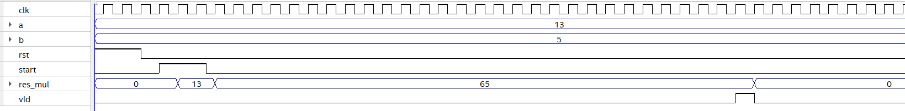
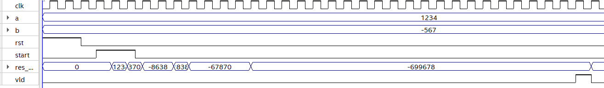
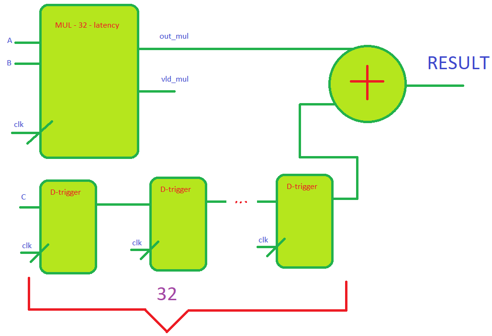
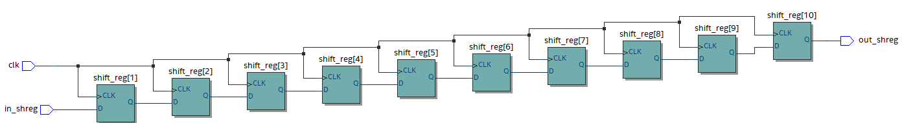
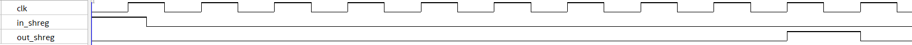
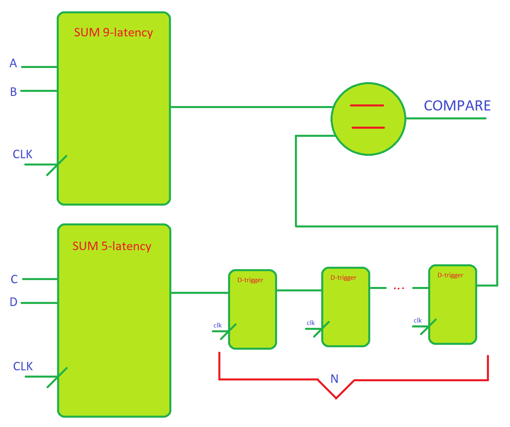

### Task 5_2. Using the shift register as a "delay"

**Exercise 1**
Implement the operation ```RESULT = a*b + c``` given that:

1) ```c``` can change every ```posedge clk```
2) The module ```mul``` performs multiplication in 32 cycles.

**Examples of ```mul``` work**





You can use the diagram below as a hint




We also have a parametrised shift register (code below)

```systemverilog
module parametrised_shift_reg
#(parameter number_stages = 10) (
	input in_shreg,
	input clk,
	output out_shreg
);

logic [number_stages : 0] shift_reg;


assign shift_reg [0] = in_shreg;
assign out_shreg = shift_reg [number_stages];

int i;

always_ff @(posedge clk) begin
	for (i = 1; i<= number_stages; i++) begin
		shift_reg [i] <= shift_reg [i-1];
	end

end

endmodule
```
Below a circuit what was synthesized according to this description on System Verilog (```number_stages = 10```)



A diagram showing that this circuit delays the input value by 10 clock cycles



To use this circuit in ```a * b + c``` the reader needs to:

1) turn the 1-bit wires into 32-bit buses
2) add the ```rst``` signal, which zeroes all the triggers

**Exercise 2. Another example of using Shift Register as a "delay"**

Let's say we have 2 adders with different lathency during calculation (in the task itself, these lathency will be modeled by shift registers)

```Latency SUM_1``` = 5 , ```Latency SUM_2``` = 9. 

Find the result of the comparison ```COMPARE = ((a + b) == (c + d))```, if the result of the sum lasts exactly 1 clock cycle on each adder (we consider the comparator ideal)

**Explanatory diagram for the condition**



**Approximate steps for solving the problem**
1) Find ```N```
2) Put ```N``` in ```parameter number_stages = N```
3) Connect modules to each other
