## Working with Gowin FPGA using ```Sipeed Tang Primer 20k``` example without scripts

Here we will talk about how to make your projects for FPGA and program it.
You should not expect from this document training in the development of circuits, here is an introduction to the board and ```Gowin EDA```.

Open the program. Create a project:

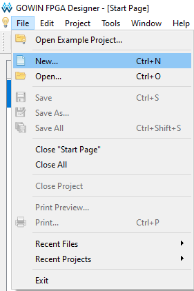

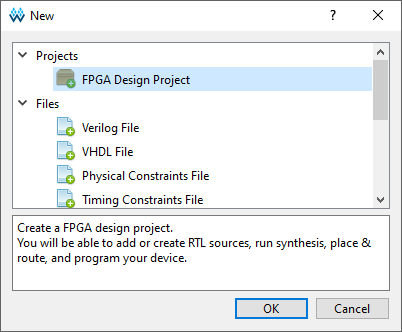

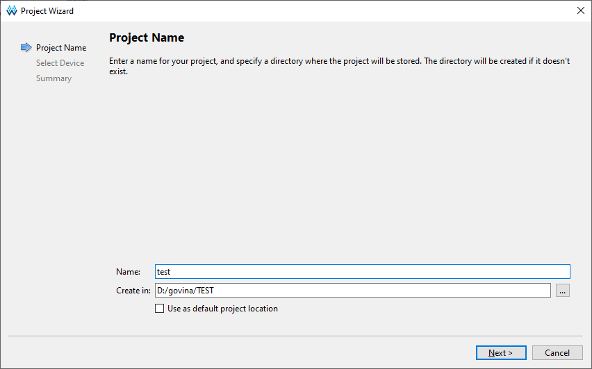

Select FPGA

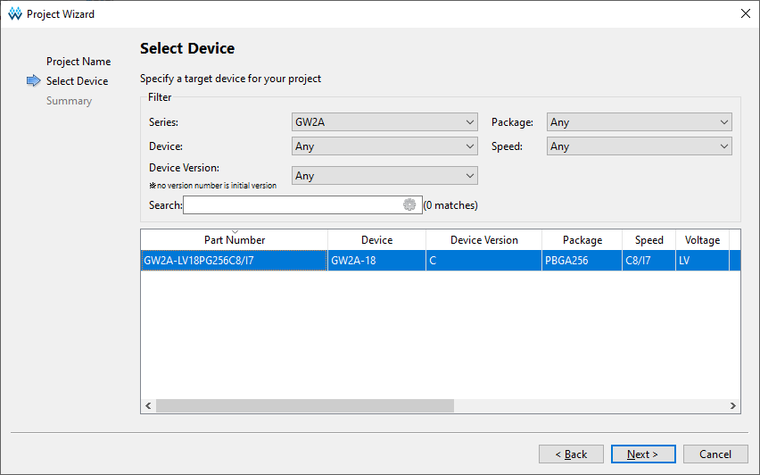

Created new file

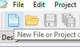

Select System Verilog file type

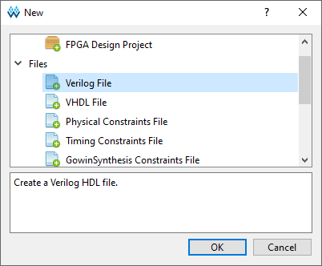

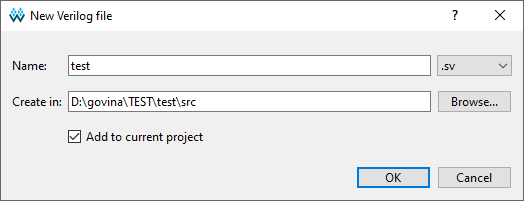

```logic``` inputs/outputs - not good

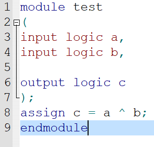

Run synthesis

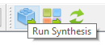

Errors

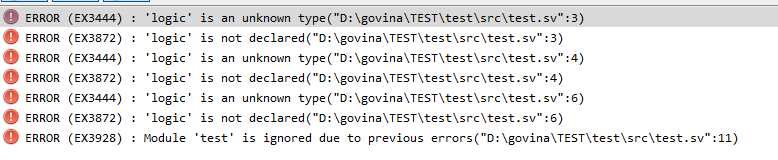

```wire``` inputs/outputs

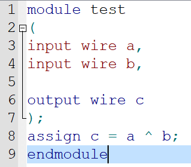

System Verilog description

```systemverilog
module test (
 input  wire a,
 input  wire b,
 output wire c
);

assign c = a ^ b;

endmodule
```

Run Synthesis


It's work !

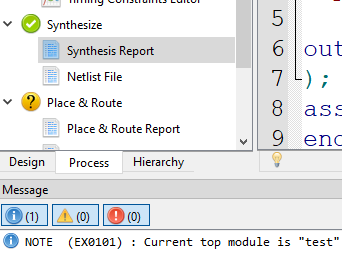

double click on p&r

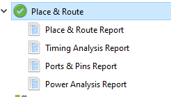

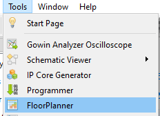

Pin Planer

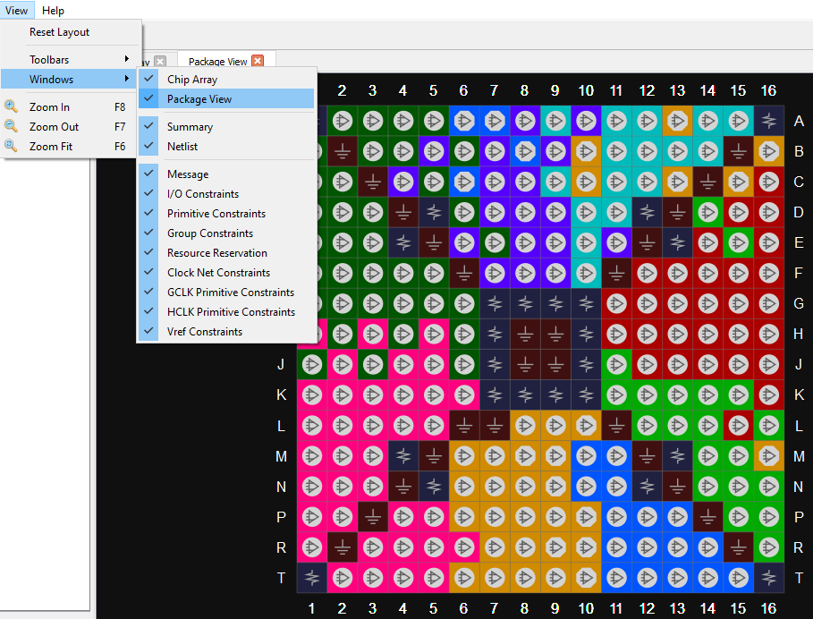

You need to select pins on the FPGA

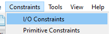

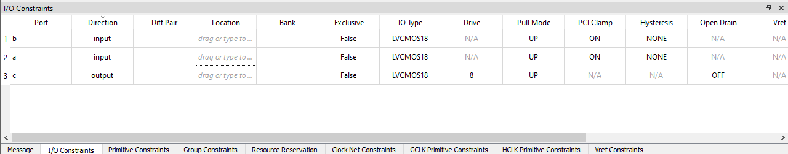

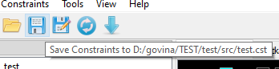

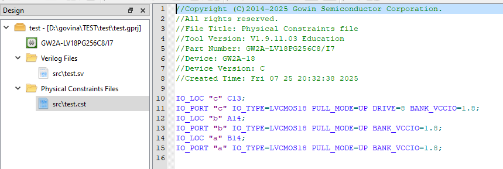

How to know, what pin is LED or switch

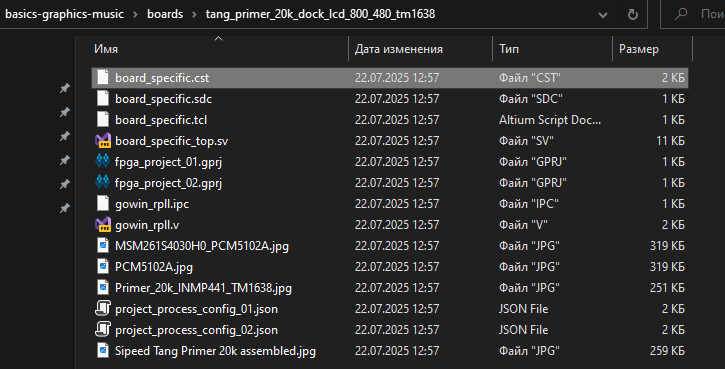

 LED's pins

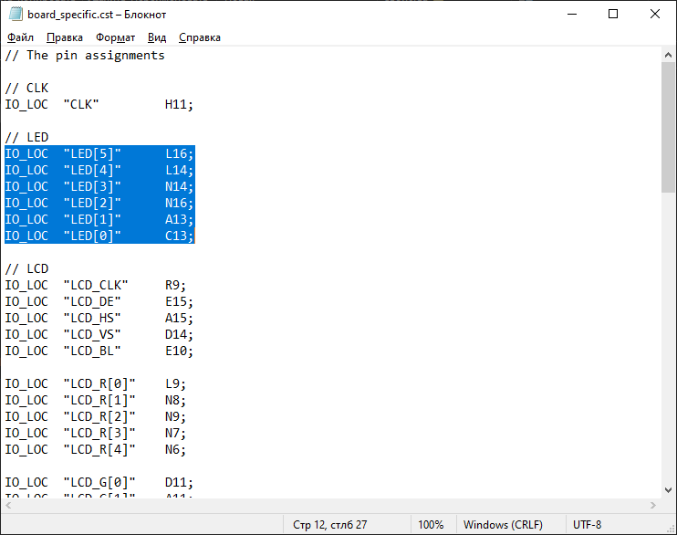

Switched pins

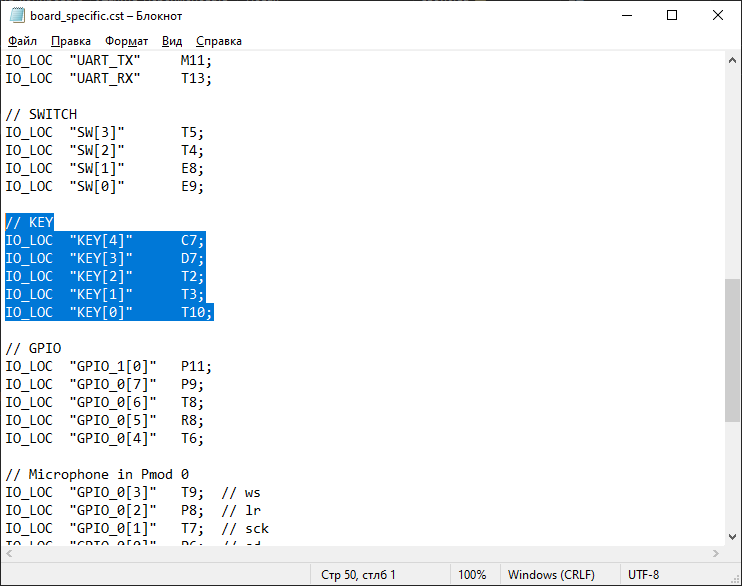

 Selected pins on Pin Planer

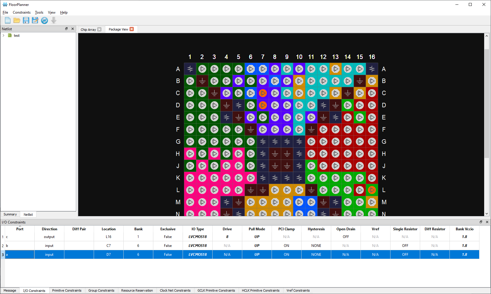

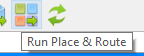

Choose jtag with this switch for programming

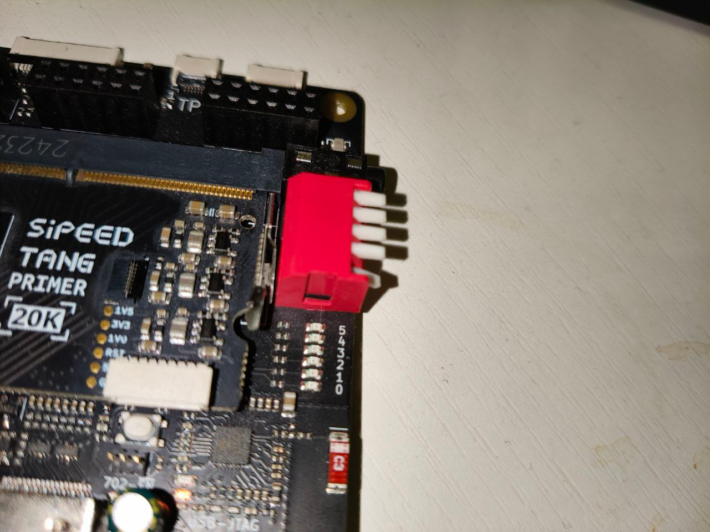

Programming

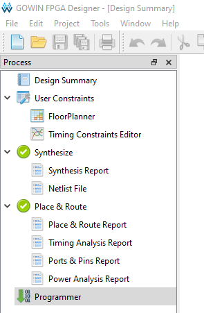

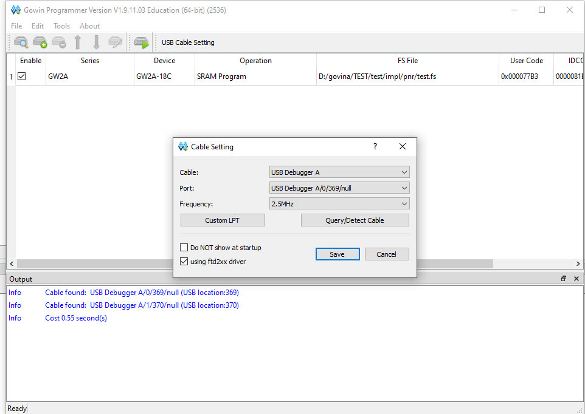

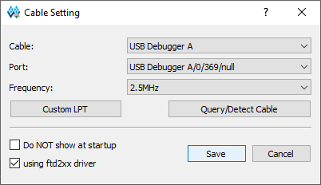

Start programming

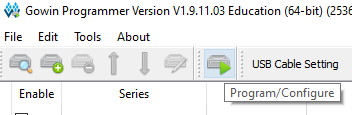

Programming finished with no errors

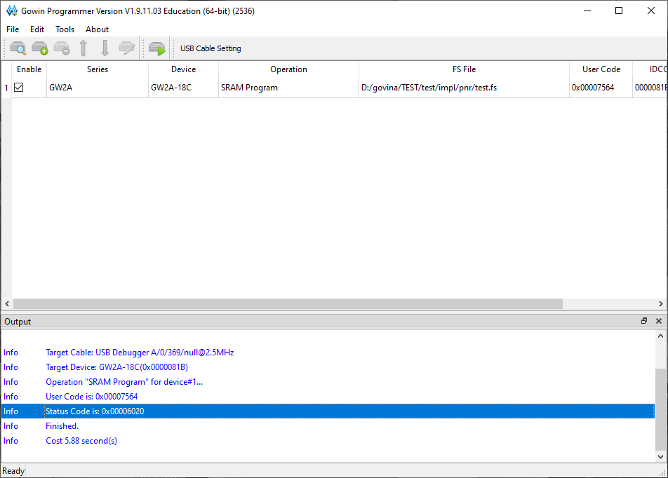

FPGA test 1

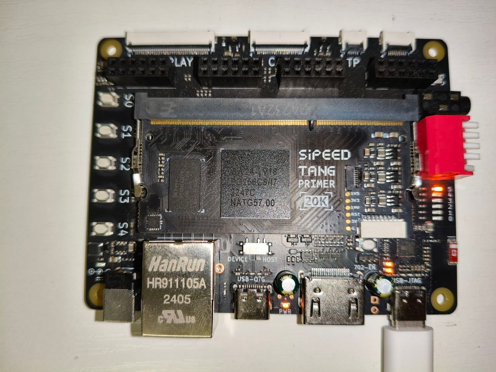

FPGA test 2

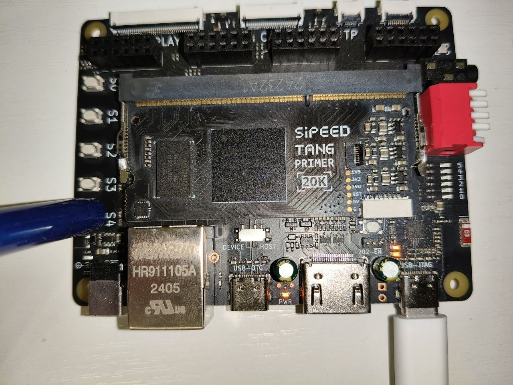

FPGA test 3

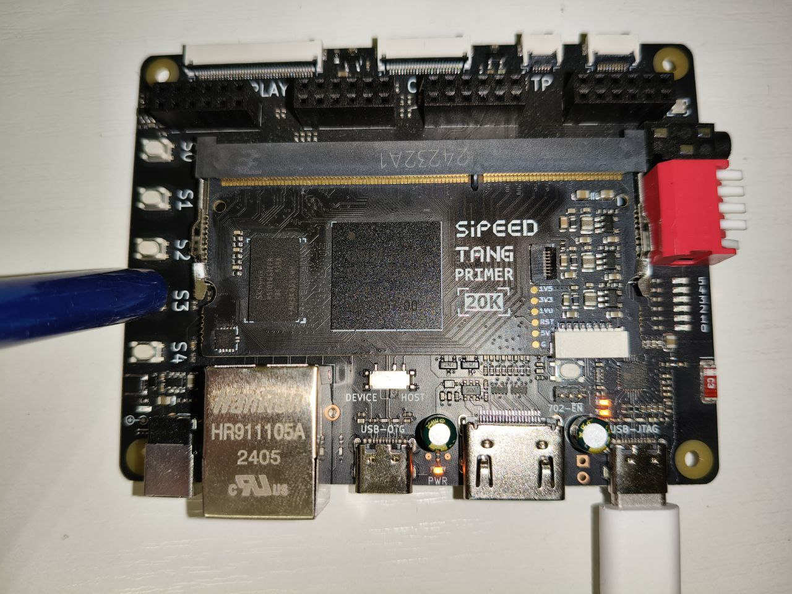

FPGA test 4

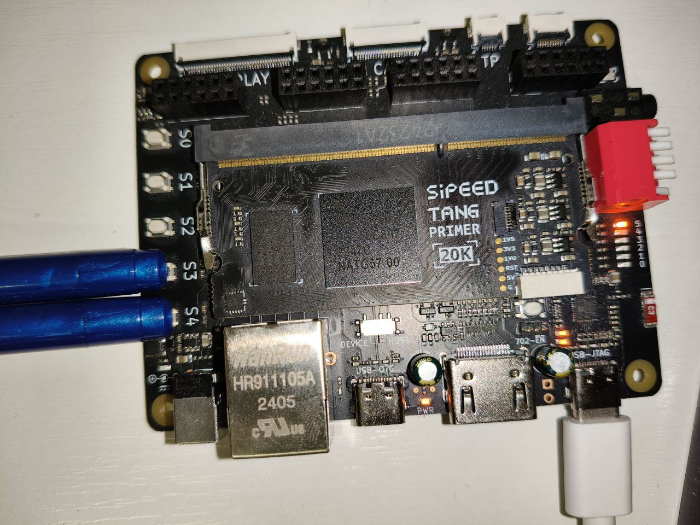


