## Introduction

A ```shift register``` is a construction made of D flip-flops. It is used to store data until the clock cycle when it is used. 
Shift registers are used for different purposes, including sequence detection (5.1) and arithmetics (5.2).

 A shift register can be introduced as a two-dimensional array with length and width, where elements are connected like 
 in the picture below, where one.
 
In particular, the one-bit wide shift register looks like this:

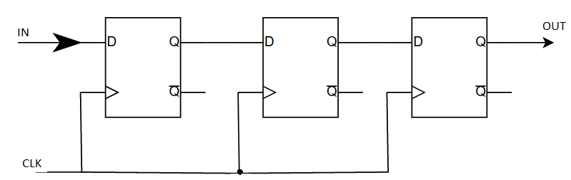

Conceptually, a shift register is the entity, which can run some tasks, such as:
1.	delay data until the second block ends calculation, but FIFO (part number) is more universal and energy-saving;
2.	make a ticker for shop (looped shift register);
3.	detect sequences, but FSMs need less memory.

### Example 1. Shift register made of 3 D flip-flops description using SystemVerilog

This example is not checked on FPGA

**Description shift register on System Verilog**

```systemverilog
module shift_reg_3_stages (
	input  logic shreg_i,
	input  clk,

	output logic shreg_o,
);

logic out_D_flip_flop_1;
logic out_D_flip_flop_2;


always_ff @(posedge clk) begin
	out_D_flip_flop_1 <= shreg_i;
	out_D_flip_flop_2 <= out_D_flip_flop_1;
	shreg_o <= out_D_flip_flop_2;
end

endmodule
```

**Shift register in Quartus**

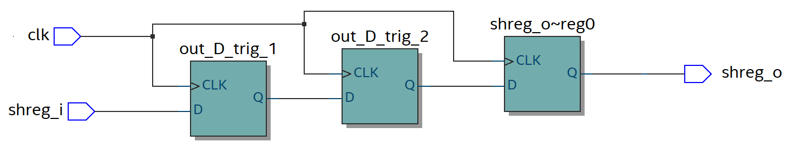


### Example on FPGA 1. Slow shift register

In folder 1 open file 2. Initially almost all code is commented. The one synthesizable code block is example 1:

```systemverilog

    wire button_on = | key;

    logic [7:0] shift_reg;

    always_ff @ (posedge slow_clock)
        if (reset)
            shift_reg <= 8'b11111111;
        else
            shift_reg <= { button_on, shift_reg [7:1] };
            // Alternatively you can write:
            // shift_reg <= (button_on << 7) | (shift_reg >> 1);

    assign led = shift_reg;
```

In this example, the ```slow_clock``` period is one second. 
This allows us to track the register state every clock cycle. The input data port is connected to buttons. 
When at least one is pushed, 0 will be written. Otherwise, ff will get 1. Data from the register is displayed on LEDs. 
The second pin of diodes is connected to VDD. So, they glow when we forward them 0s.

To launch the example, open the terminal in ```05_shift_regisher``` and launch synthesis.

If the board is connected, it will be programmed automatically. As a result, 
a log file and ```impl``` folder with a project will be created. The project contains all the files used for 
synthesis, synthesis results and files with info about the design.

### Exercise 1. LED's moves in the opposite direction

You have a file ```hackathon_top```, in which the lights run from left to right, but you need to change the direction of their movement to the opposite. To do this, it is proposed to change the new state of the register so that the value of ```button_on``` is pushed in from the other side.

To do this simply change it : ```shift_reg <= { button_on, shift_reg [7:1] };```

### RTL-viewer

To look at the synthesized circuit, launch ```05 script``` and find the black box called hackathon_top in the ```RTL viewer```.

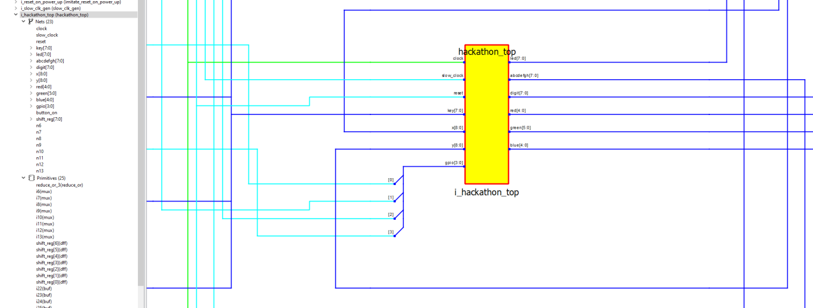

Click twice on it in ```Gowin EDA``` or once on plus in ```Quartus``` to show contents. The circuit will be:

**Shift register with ```rst``` in  GOWIN ```RTL-Viewer```**

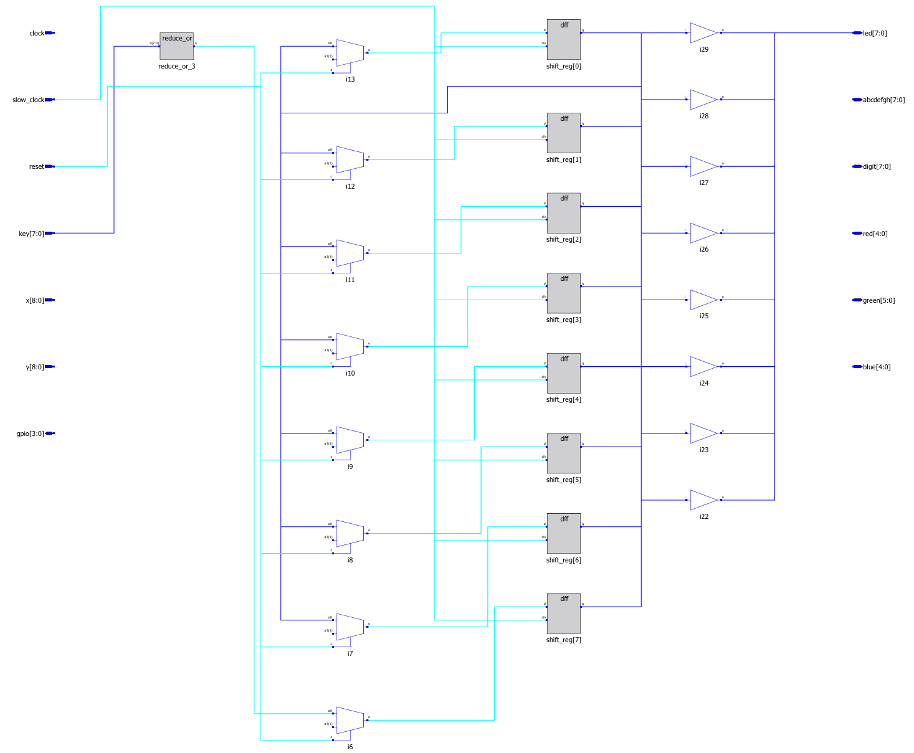

Try to find out what creates ```slow_clock```. On the left side we can see project files, most of which are made 
as black boxes for us, and they are in the other folder. To the right, elements of the design are. Here choose
a wire (in Nets) ```slow_clock```. It will be highlighted in red on the circuit to the right:

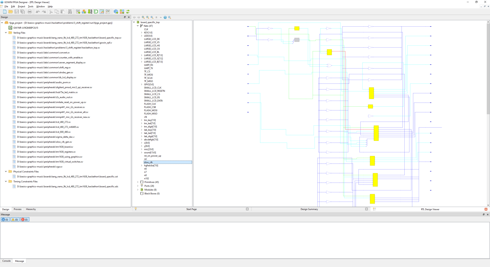

Find the source, which is connected to the wire with the right side.

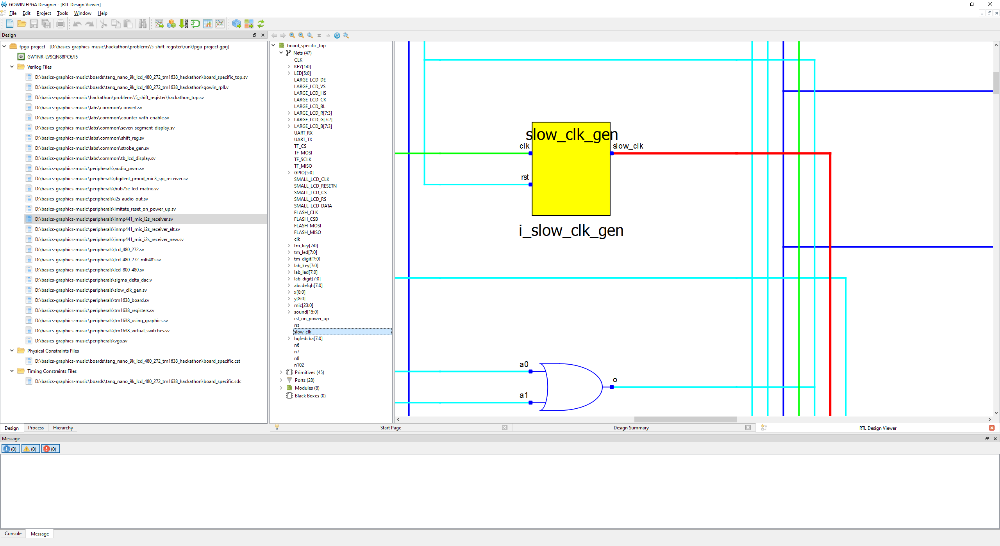

Unwrap:
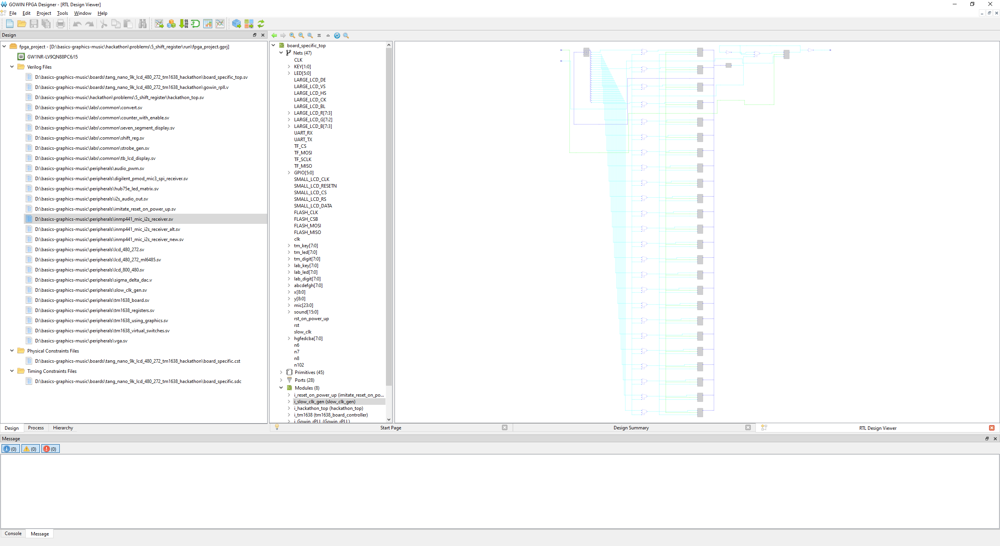

The circuit doesn’t look good, but we can find a text description. Right click on the circuit, then click ```pop```.

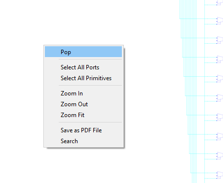

We got back to the full circuit. Look at the ```slow_clock``` generator.


It has two names. The upper one is for module description and the lower one is from instantiation. We need the 
description, so click on the upper one and go to definition:

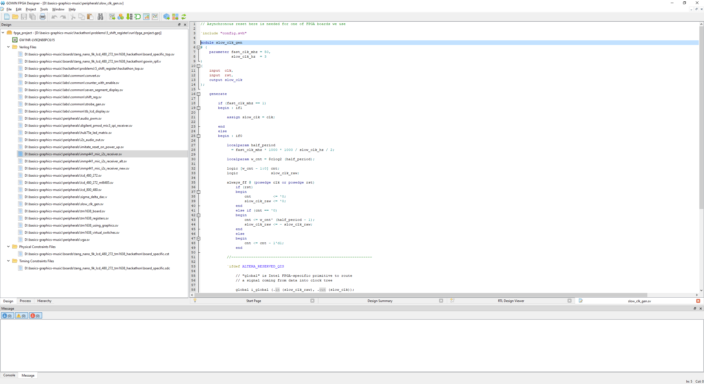

This is a typical realization of a frequency divider using a counter. Below, there is the name of the file 
containing this module (```slow_clk_gen```).

This manual doesn’t provide learning these modules in detail, all changes should be in ```hackathon_top.sv```. 
However, ```parameter``` and ```localparam``` used in these modules will be described separately in the exercises
```folder_name/file_name```.

### Example on board 2. A solution with ```enable``` from black box

In the previous sourse we used the signal from the black box (external module)

In this example ```slow_clock``` replaced on the ```enable``` from module ```strobe_gen```.


When it is at 1, writing to the flip-flop is enabled, and the LEDs move. 
However, it only stays at 1 for one period of the ```clock``` signal, then drops to 0 for the desired period of register
update. 
The code shows that the ```strobe_hz``` parameter sets the frequency we are interested in, so it is suggested to run the example with several of its values.

**Timing diagram**

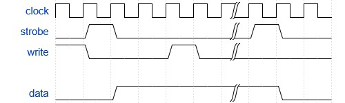

Take the first example in the comment (```/*  */```). Remove the comment from the block of code:

```systemverilog
// A solution with enable from the strobe generator
    wire enable;
    strobe_gen # (.clk_mhz (27), .strobe_hz (10))
    i_strobe_gen (.clk (clock), .rst (reset), .strobe (enable));

    wire button_on = | key;

    logic [7:0] shift_reg;

    always_ff @ (posedge clock)
        if (reset)
            shift_reg <= 8'b11111111;
        else if (enable)
            shift_reg <= { button_on, shift_reg [7:1] };
            // Alternatively you can write:
            // shift_reg <= (button_on << 7) | (shift_reg >> 1);

    assign led = shift_reg;
```

**```RTL-viewer``` in GOWIN**

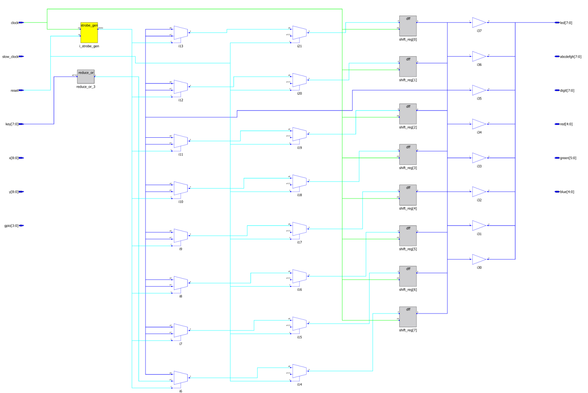

Since ```strobe_gen``` also built on a counter, his schematic equals frequency divider ```slow_clk```  and will not been shown.

### Example on board 3. A solution with ```enable``` from counter

In the following example, the counter is declared explicitly. Instead of setting a fixed number at the initial moment and decreasing by 1 to zero, for simplicity, the counter is always increased by 1. 

Resetting to 0 occurs when overflow occurs. Therefore, the time can be specified with an accuracy of up to powers of two. Let's make some estimates.

Frequency of ```clock``` = 27 MHz

```N``` - number of counter bits

The values in the counter responsible for ```enable``` change every ```clock``` period, equal to 37.04 ns

**Period ```T``` from number of counter bits ```N```.**


|     N     	|     T, s        	|
|-----------	|-----------------	|
|     20    	|     0,038836    	|
|     21    	|     0,077672    	|
|     22    	|     0,155345    	|
|     23    	|     0,310689    	|
|     24    	|     0,621378    	|
|     25    	|     1,242757    	|
|     26    	|     2,485513    	|
|     27    	|     4,971027    	|
|     28    	|     9,942054    	|
|     29    	|     19,88411    	|
|     30    	|     39,76822    	|
|     31    	|     79,53643    	|


**Description of this example on System Verilog**
```systemverilog
    // A solution with enable from a counter
    logic [31:0] counter;

    always_ff @ (posedge clock)
        if (reset)
            counter <= 0;
        else
            counter <= counter + 1;

    wire enable = (counter [22:0] == 0);
    // Try different slices here, for example "counter [20:0] == 0"

    wire button_on = | key;

    logic [7:0] shift_reg;

    always_ff @ (posedge clock)
        if (reset)
            shift_reg <= 8'b11111111;
        else if (enable)
            shift_reg <= { button_on, shift_reg [7:1] };
            // Alternatively you can write:
            // shift_reg <= (button_on << 7) | (shift_reg >> 1);

    assign led = shift_reg;
```
**```RTL-viewer``` in GOWIN**

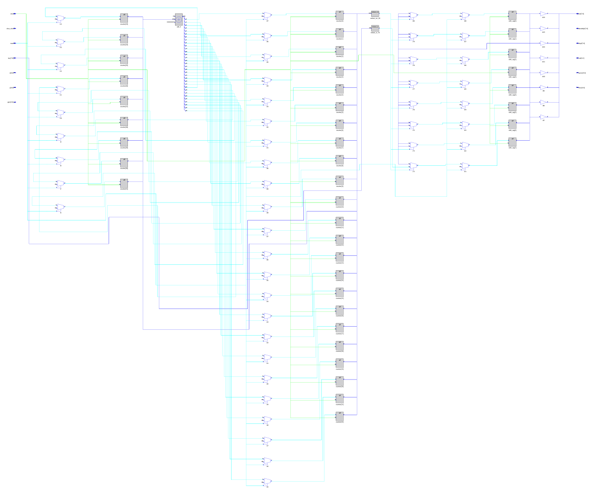

### Example to exercise 2. Treading line from LED's.

Let's say we have 4 LEDs, and we want to turn off the LEDs with buttons (5 of them, 4 control the LEDs, 1 is ```write```), after we press the write button (write = 0), then we should have a sequence of lights running in a circle.

If ```write``` = 1, then the values are written to the LEDs (like a running line on pause).

Below is an example of how such a thing works with 4 LEDs with different initial loads.

**Running line, initial load 1**


**Running line, initial load 2**


**Description on System Verilog for 4 LED's**

This example is not checked in FPGA

```systemverilog
module run_led_with_write (
	input  logic data_in_led,
	input  logic clk,
	input  logic write,
	
	output logic led_out
);

logic [3:0] shreg;
assign led_out = shreg;

always_ff @(posedge clk) begin
	if (write) shreg <= data_in_led;
	else begin
		shreg[0] <= shreg[3];
		shreg[1] <= shreg[0];
		shreg[2] <= shreg[1];
		shreg[3] <= shreg[2];
	end
end

endmodule
```


**Checking the circuit on VWF ("1" = LED is off)**
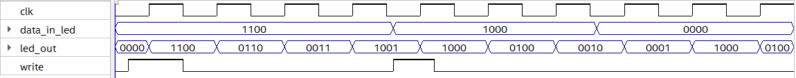

### Exercise on the board 2. Display the state of the shift register on the seven-segment indicator


**Running line (graph)**

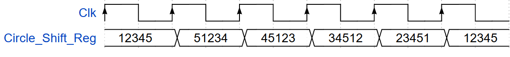

**Seven Segment Display Module (uncomment it)**

```systemverilog
seven_segment_display # (.w_digit (8)) i_7segment
    (
        .clk      ( clock    ),
        .rst      ( reset    ),
        .number   ( counter  ),
        .dots     ( '0       ),  // This syntax means "all 0s in the context"
        .abcdefgh ( abcdefgh ),
        .digit    ( digit    )
    );
```

**Description  System Verilog thr runnimg line**

In this example, we replaced the single-bit wires with 4-bit buses.

This example is not checked in FPGA


```systemverilog
module run_led_with_write (
	input  logic [3:0] data_in_led,
	input  logic       clk,
	input  logic       write,
	
	output logic [3:0] led_out
);

logic [3:0] shreg;
assign led_out = shreg;

always_ff @(posedge clk) begin
	if (write) shreg <= data_in_led;
	else begin
		shreg[0] <= shreg[3];
		shreg[1] <= shreg[0];
		shreg[2] <= shreg[1];
		shreg[3] <= shreg[2];
	end
end

endmodule
```
