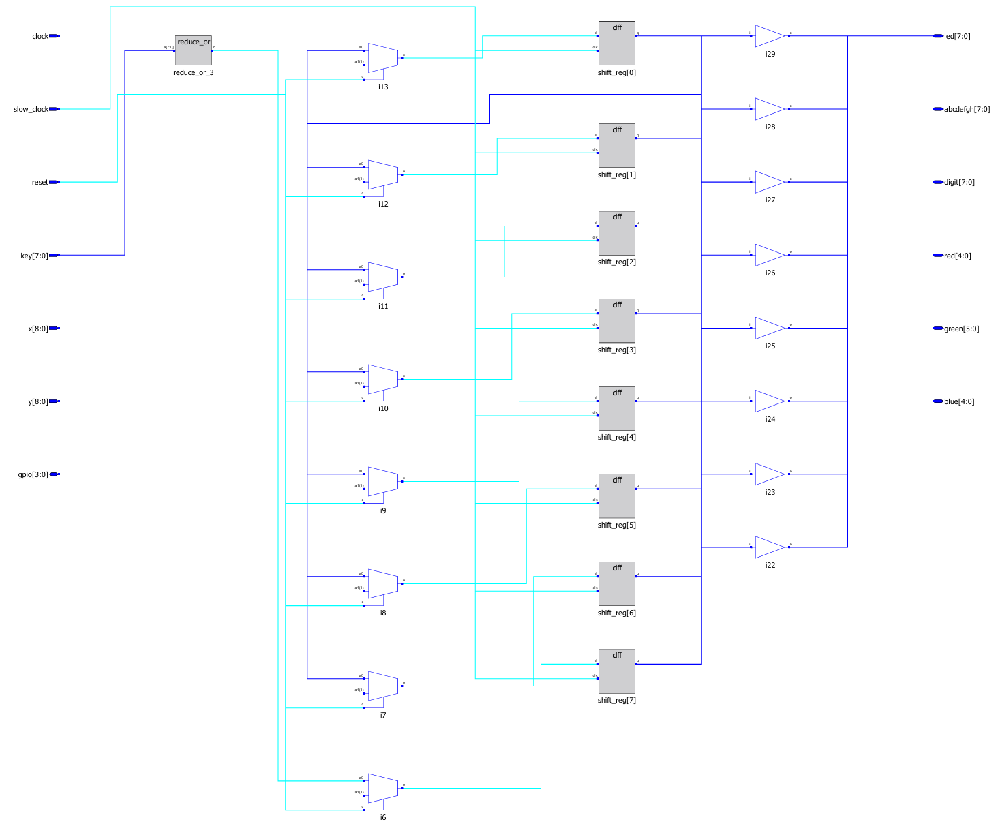
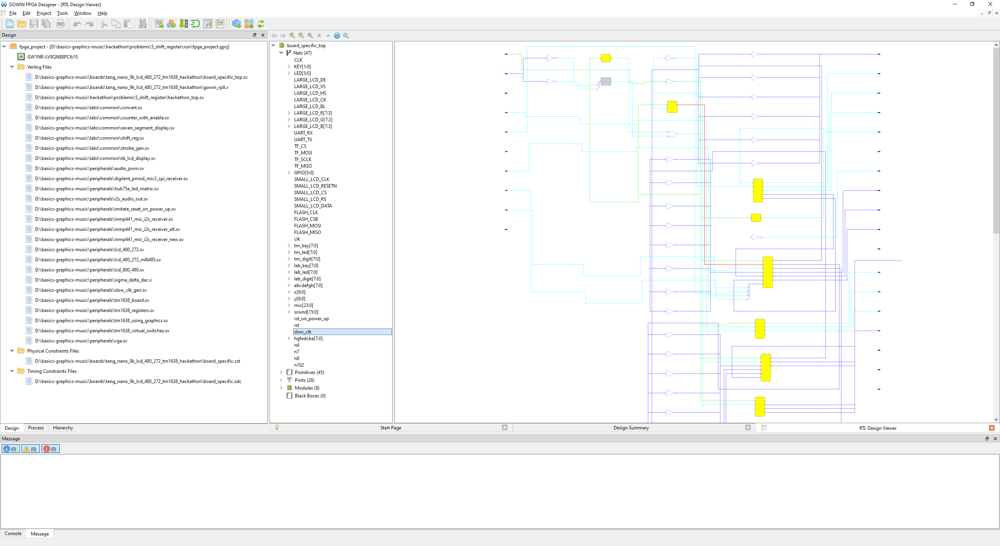
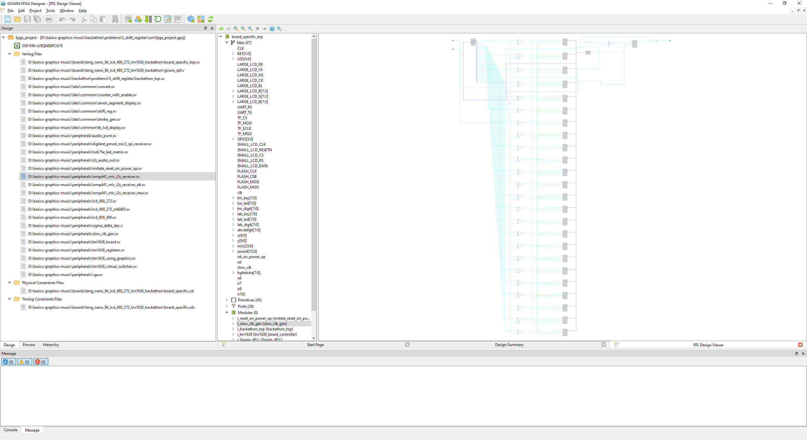
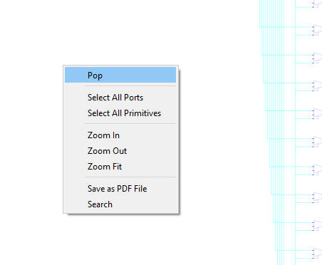
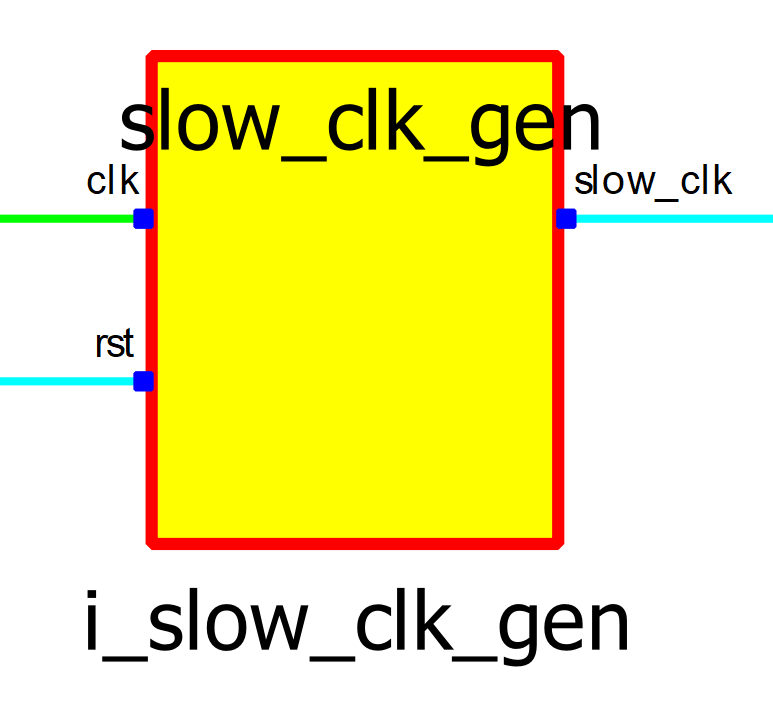
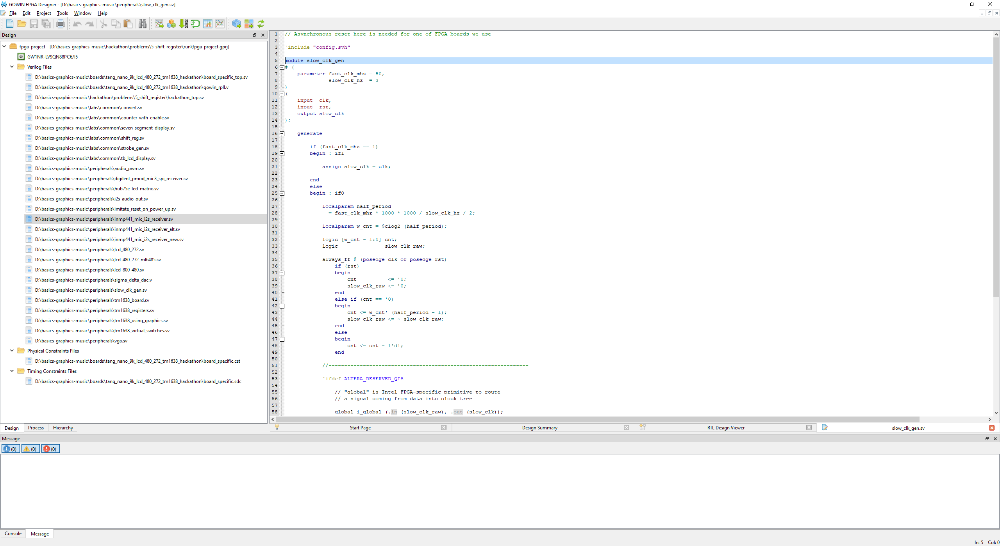
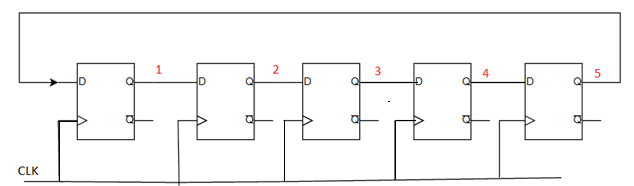

## Вступление

Сдвиговый регистр - это конструкция из D-триггеров. Она предназначена для временного хранения данных до такта, в котором они будут использованы. Сдвиговые регистры используются для разнообразных целей, в том числе распознавания последовательностей (5.1) и организации математических вычислений (5.2).

Сдвиговый регистр можно представить в виде двумерного массива с шириной и глубиной, в котором элементы соединены следующим образом:

Частный случай - это сдвиговый регистр шириной 1 бит, который выглядит так:


### Пример 1. Описание на System Verilog сдвигового регистра из 3 D-триггеров

В данном примере мы рассмотрим простейшее описание сдвигового регистра на System Verilog

**Сдвиговый регистр, в Quartus**


**Описание Shift Register на System Verilog**

```systemverilog
module shift_reg_3_stages (
	input  logic shreg_i,
	input  clk,

	output logic shreg_o,
);

logic out_D_flip_flop_1;
logic out_D_flip_flop_2;


always_ff @(posedge clk) begin
	out_D_flip_flop_1 <= shreg_i;
	out_D_flip_flop_2 <= out_D_flip_flop_1;
	shreg_o <= out_D_flip_flop_2;
end

endmodule
```

**Что вы скорее всего увидите в RTL-viewer**


На самом деле, реально данная схема и схема выше эквивалентны, но тут
Quartus для оптимизации ресурсов слил 2 D-триггера в 1.


### Пример на плате 1. Медленный сдвиговый регистр

В папке ```5_shift_register``` откройте файл ```hackathon_top.sv```.
Изначально почти всё содержимое файла закомментировано. Единственный 
синтезируемый блок кода сейчас - это пример 1:
```systemverilog

    wire button_on = | key;

    logic [7:0] shift_reg;

    always_ff @ (posedge slow_clock)
        if (reset)
            shift_reg <= 8'b11111111;
        else
            shift_reg <= { button_on, shift_reg [7:1] };
            // Alternatively you can write:
            // shift_reg <= (button_on << 7) | (shift_reg >> 1);

    assign led = shift_reg;
```
В этом примере период тактового сигнала ```slow_clock``` равен одной секунде. 
Это позволяет по тактам отследить работу регистра. 
Вход данных регистра подключён к кнопкам. 
Если хотя бы одна нажата, запишется 0, иначе – 1.
Содержимое регистра выводится на светодиоды. 
Второй вывод светодиодов подключён к питанию.
Поэтому они горят, когда на них выводится 0.
Для запуска примера откройте терминал в папке ```5_shift_register``` и запустите синтез.

Если плата подключена к компьютеру, прошивка произойдёт автоматически (у меня не открылся установленный programmer, видимо, из-за отсутствия платы). 
В результате в папке появится файл с логом, созданный при синтезе ```Gowin EDA```, а также папка ```impl``` с проектом.
Проект содержит все файлы, используемые для синтеза, результаты синтеза и файлы с информацией о дизайне. 

### Упражнение на плате 1. Заставьте огоньки двигаться в противоположном направлении

У вас имеется файл ```hackathon_top```, в котором огоньки бегут, условно (уточнить) , слева направо, вам же надо поменять направление их движения на противоположное. Для этого предлагается изменить новое состояние регистра так, чтобы значение ```button_on``` вталкивалось с другой стороны. 

Для этого достаточно поменять строку ```shift_reg <= { button_on, shift_reg [7:1] };```.

### Просмотр схемы в ```RTL-Viewer```

Для просмотра синтезируемой схемы запустите скрипт 05, причём только после синтеза, и в ```rtl viewer``` найдите чёрный ящик ```hackathon_top```:


Нажмите на него 2 раза в ```Gowin EDA``` или на плюс в ```Quartus```, чтобы
развернуть содержимое. Схема будет следующая:

**Shift register with ```rst``` in  GOWIN ```RTL-Viewer```**



Посмотрим, что создаёт ```slow_clock```. Слева все файлы проекта, большая часть которых скрыта за чёрными ящиками, которые мы можем использовать, в том числе в своём файле, но лежат они в другой папке. Правее список элементов дизайна. Там находим провод (Net) ```slow_clock```. Он будет подсвечен красным на схеме справа:



Находим источник, у него этот провод подключён с правой стороны.


Разворачиваем:



Схема выглядит непонятно, найдём текстовое описание. Нажимаем на схеме
ПКМ - Pop:



Вернулись к полной схеме. Рассмотрим генератор ```slow_clk```.




У него два названия. Верхнее было дано при описании модуля, нижнее --
при установке. Нас интересует описание, поэтому нажимаем на верхнее
название и переходим к объявлению:



Здесь типичная реализация делителя частоты счётчиком.
Внизу название файла, в котором модуль объявлен (```slow_clk_gen```). 

Данная инструкция не предполагает подробное знакомство с модулями, все операции предлагается проводить в ```hackathon_top.sv```.
Однако, используемые этих модулях ```parameter``` и ```localparam``` будут рассмотрены отдельно в статье

[Статья про parameter и localparam](param_and_localparam_ru.md)

### Пример на плате 2. Реализация через сигнал enable

В прошлом примере мы опирались на сигнал ```slow_clock```
от внешней чёрной коробки.
В этом примере ```slow_clock``` заменён на сигнал
```enable```, поступающий с модуля ```strobe_gen```.

Когда он в состоянии 1, запись
в триггеры разрешена, и огоньки движутся. 
Правда, в 1 он держится только
один период сигнала ```clock```, затем опускается в 0 на желаемый период
обновления регистра. 
В коде видно, что параметр ```strobe_hz``` задаёт
интересующую нас частоту, поэтому предлагается запустить пример с
несколькими его значениями. 

**Временная диаграмма для наглядности:**


Возьмите первый пример в комментарий (```/*  */```). Уберите комментарий со 
следующего блока кода:

```systemverilog
// A solution with enable from the strobe generator
    wire enable;
    strobe_gen # (.clk_mhz (27), .strobe_hz (10))
    i_strobe_gen (.clk (clock), .rst (reset), .strobe (enable));

    wire button_on = | key;

    logic [7:0] shift_reg;

    always_ff @ (posedge clock)
        if (reset)
            shift_reg <= 8'b11111111;
        else if (enable)
            shift_reg <= { button_on, shift_reg [7:1] };
            // Alternatively you can write:
            // shift_reg <= (button_on << 7) | (shift_reg >> 1);

    assign led = shift_reg;
```

**Схема:**


Поскольку ```strobe_gen``` тоже построен на счётчике, схема его аналогична
генератору ```slow_clk``` и показана не будет.


### Пример на плате 3. Генерация enable счётчиком

В следующем примере счётчик объявлен явно. Вместо выставления
фиксированного числа в начальный момент и уменьшения на 1 до нуля
(эффективнее) для простоты счётчик увеличивается на 1 всегда. 

Сброс в 0
происходит при переполнении. В связи с этим время можно задавать с
точностью до степеней двойки. Проведём оценки.

Частота ```clock```: 27 MHz

```N``` - разрядность счетчика

Значения в счетчике, отвечающем за ```Enable``` меняются  каждый период ```clock```, равный  37.04 нс

**Для удобства ниже приведены посчитанные по формуле значения периода T
в секундах для нескольких значений N.**


|     N     	|     T, с        	|
|-----------	|-----------------	|
|     20    	|     0,038836    	|
|     21    	|     0,077672    	|
|     22    	|     0,155345    	|
|     23    	|     0,310689    	|
|     24    	|     0,621378    	|
|     25    	|     1,242757    	|
|     26    	|     2,485513    	|
|     27    	|     4,971027    	|
|     28    	|     9,942054    	|
|     29    	|     19,88411    	|
|     30    	|     39,76822    	|
|     31    	|     79,53643    	|


**Код примера**
```systemverilog
    // A solution with enable from a counter
    logic [31:0] counter;

    always_ff @ (posedge clock)
        if (reset)
            counter <= 0;
        else
            counter <= counter + 1;

    wire enable = (counter [22:0] == 0);
    // Try different slices here, for example "counter [20:0] == 0"

    wire button_on = | key;

    logic [7:0] shift_reg;

    always_ff @ (posedge clock)
        if (reset)
            shift_reg <= 8'b11111111;
        else if (enable)
            shift_reg <= { button_on, shift_reg [7:1] };
            // Alternatively you can write:
            // shift_reg <= (button_on << 7) | (shift_reg >> 1);

    assign led = shift_reg;
```
**Что будет в rtl-viewer**


### Пример к упражнению 2. Бегущая строка из светодиодов.

Пускай у нас имеется 4 светодиода, и мы кнопками (5 штук, 4 управляют светодиодами, 1 является write) хотим гасить светодиоды, после того, как мы отжали кнопку ```write``` (write = 0), то у нас должна последовательность огоньков по кругу бежать.

Если же ```write = 1```, то идет запись значений в светодиоды (как бы бегущая строка на паузе).

Ниже пример работы такой штуковины из 4 светодиодов с разными начальными загрузками.

**Бегущая строка, пример 1**


**Бегущая строка, пример 2**


**Пример на System Verilog для 4 светодиодов**

Этот пример не проверяется в плате

```systemverilog
module run_led_with_write (
	input  logic data_in_led,
	input  logic clk,
	input  logic write,
	
	output logic led_out
);

logic [3:0] shreg;
assign led_out = shreg;

always_ff @(posedge clk) begin
	if (write) shreg <= data_in_led;
	else begin
		shreg[0] <= shreg[3];
		shreg[1] <= shreg[0];
		shreg[2] <= shreg[1];
		shreg[3] <= shreg[2];
	end
end

endmodule
```


**Проверка схемы на VWF ("1" = светодиод не горит)**


### Упражнение на плате 2. Изобразите состояние сдвигового регистра на семисегментном индикаторе



**Бегущая строка (график)**


**Модуль семисегментного индикатора (раскомментируйте его)**

```systemverilog
seven_segment_display # (.w_digit (8)) i_7segment
    (
        .clk      ( clock    ),
        .rst      ( reset    ),
        .number   ( counter  ),
        .dots     ( '0       ),  // This syntax means "all 0s in the context"
        .abcdefgh ( abcdefgh ),
        .digit    ( digit    )
    );
```

**Пример на System Verilog для бегущей строки**

В данном примере мы одднобитные провода заменили на 4-битные шины

Этот пример не проверяется в плате


```systemverilog
module run_led_with_write (
	input  logic [3:0] data_in_led,
	input  logic       clk,
	input  logic       write,
	
	output logic [3:0] led_out
);

logic [3:0] shreg;
assign led_out = shreg;

always_ff @(posedge clk) begin
	if (write) shreg <= data_in_led;
	else begin
		shreg[0] <= shreg[3];
		shreg[1] <= shreg[0];
		shreg[2] <= shreg[1];
		shreg[3] <= shreg[2];
	end
end

endmodule
```

