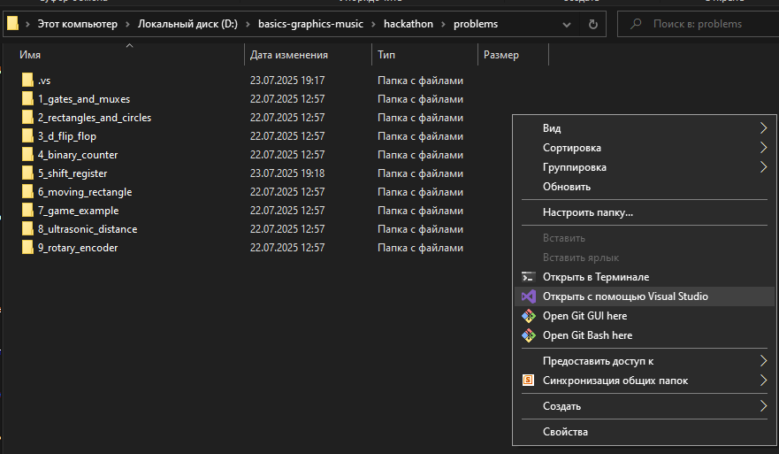
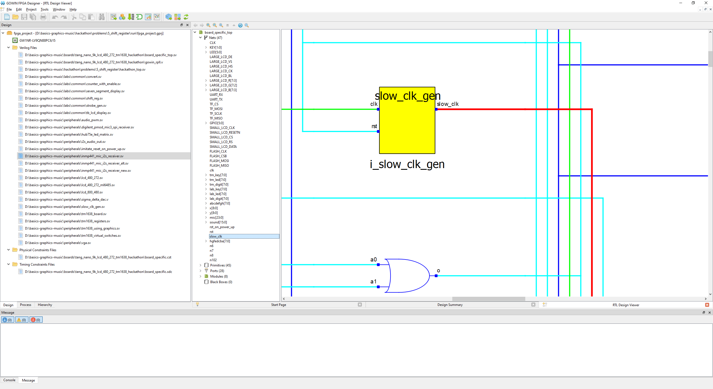
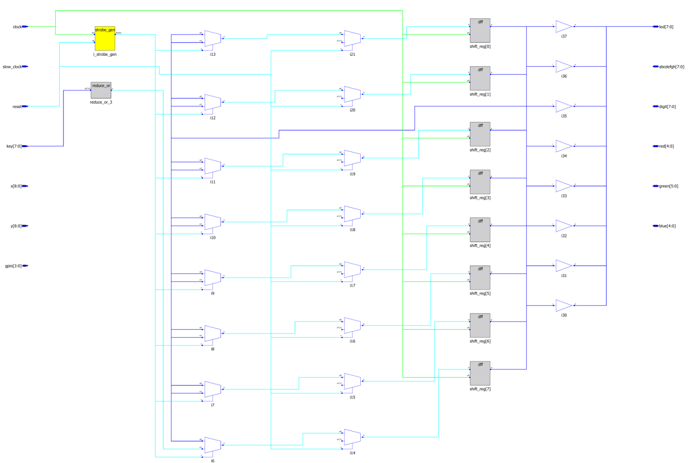

**Информация для проверяющих**

Поскольку на последней встрече Юрий указал на необходимость делать
подробное пособие по запуску с точностью до клика мыши (воспринимаю как
небольшое преувеличение), здесь будет унифицированная информация по
запуску примеров в visual studio, которую я по привычке использую вместо
vs code.

On the last review Yuri said we need to show every mouse click here (I
don't think it was literally). So, here is unified information about
running examples in visual studio.

**Запуск примеров в visual studio; win10**

1.  Открыть visual studio

Для этого перейти в папку с заданиями, нажать ПКМ - открыть с помощью
visual studio.



Второй вариант - напрямую через меню visual studio (открыть локальную
папку, выбрать папку problems):


2.  Настроить терминал для работы со скриптами

Выберите папку с выполняемым заданием, нажмите на неё ЛКМ, затем ПКМ --
открыть в терминале.


Автоматически может открыться командная строка от Microsoft, но наши
скрипты для bash. Предполагается, что у Вас есть git. В открывшемся
терминале нажмите на шестерёнку (параметры).


В открывшемся окне нажмите «добавить»:


Появится ещё одна строка. Внизу будут её настройки. Назовите, например,
bash. Укажите расположение к файлу bash.exe. Файл лежит там, где
установлен git, в папке bin. Аргументы можно стереть. После внесения
этих изменений нужно нажать «применить». Проверьте, что нужные настройки
сохранились. Ниже пример созданного профиля.



При желании нажмите также «использовать по умолчанию», чтобы не менять
терминал на bash каждый раз. Окно можно закрыть.

Чтобы сменить терминал, нажмите на стрелку правее используемого по
умолчанию профиля и выберите созданный профиль:


При изменении, вероятно, терминал откроется в изначальной папке.
Проверьте адрес, выведенный в терминале и при необходимости смените
папку.

Команда для спуска в выбранную папку на уровень ниже:

```bash
cd ./имя_папки/
```

Точка означает папку, в которой терминал сидит сейчас. Две точки подряд
говорят подняться на уровень выше. Примеры использования команд для
перемещения между заданиями ниже.


Терминал готов к работе.

P.S. Под окном терминала все открытые вкладки, закрывайте ненужные:



3.  Запуск скриптов

Всего используется 4 bash-скрипта. По сути, они лишь ищут и запускают
другие скрипты из репозитория, но в той папке, где они сами лежат.

Скрипты пронумерованы, как и папки. Это сделано для удобства работы с
bash. Чтобы запустить интересующий скрипт, введите ```./``` и начните писать
название скрипта (его номер). Далее нажмите Tab, и название будет
введено полностью автоматически.


Назначение скриптов:

```01_clean``` - убрать файл лога, созданный скриптом 03

```03_synthesize_for_fpga``` - запустить синтез аппаратуры

```04_configure_fpga``` - выбрать программу для синтеза аппаратуры, у меня не
заработал

```05_run_gui_for_fpga_synthesis``` - показать графический интерфейс
программы для синтеза, запускать после скрипта 03 для просмотра
параметров проекта и программирования платы

Посмотреть схематик можно здесь:


Синтез вручную в Gowin EDA (то же, что скрипт 03) делает кнопка:


Программирование у меня не работает, и отладочной платы на данный момент
нет.

Чтобы продолжить пользоваться терминалом, программу нужно закрыть.
