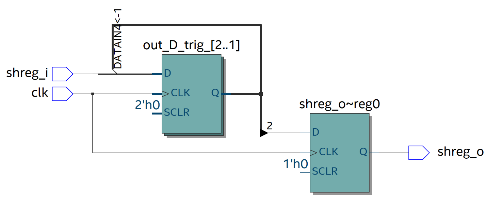
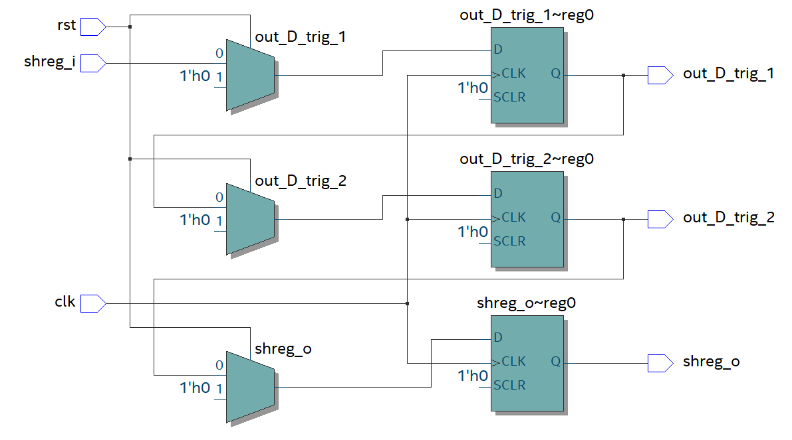
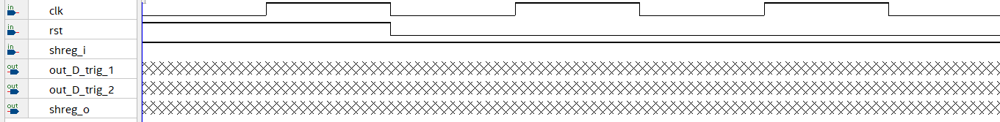
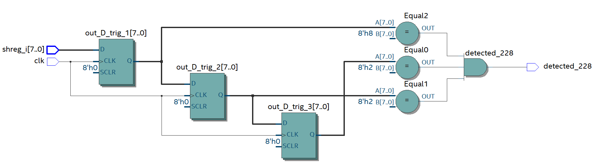
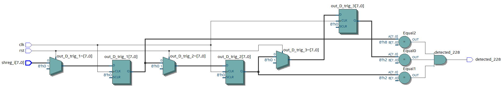
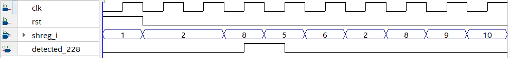
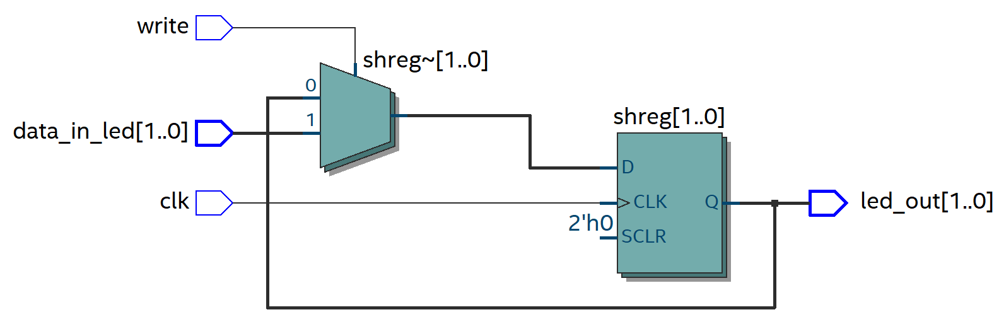
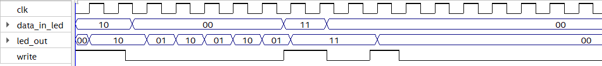

**Вступление**

Сдвиговый регистр является одной из "стандартных" сущностей цифровой схемотехники, с которой читателю будет весьма полезно ознакомиться
(хотя бы для того, чтобы при разработке проекта использовать его как "затычку", а далее уже думать про то, что может его заменить 
(хотя в частных случаях он может быть в определенных аспектах выгоднее того же FIFO и FSM, например, при работе с элементами с постоянной латентностью).

В данной статье авторы подготовили несколько более-менее простых и содержательных задачек с пояснениями про сдвиговый регистр, которые, как мы надеемся, будут полезны читателям.

**Сдвиговый регистр.**


Концептуально, сам сдвиговый регистр представляет из себя сущность,
которая может выполнять некоторые задачи, такие как:
1) "Задержать" уже выполненное значение до того момента, как
второе устройство закончит считать (но FIFO универсальнее и меньше энергии ест)
2) Сделать бегущую строку для магазина (кольцевой сдвиговый регистр)
3) Детектировать определенную последовательность (но для FSM меньше бит надо)

**Пример 1. Сдвиговый регистр как бегущая строка**


**Бегущая строка (график)**


**Пример 2. Описание на System Verilog сдвигового регистра из 3 D-триггеров**


В данном примере мы рассмотрим простейшее описание сдвигового регистра на System Verilog

**Сдвиговый регистр, в Quartus**


**Описание Shift Register на System Verilog**

```systemverilog
module shift_reg_3_stages (
	input  logic shreg_i,
	input  clk,

	output logic shreg_o,
);

logic out_D_trig_1;
logic out_D_trig_2;


always_ff @(posedge clk) begin
	out_D_trig_1 <= shreg_i;
	out_D_trig_2 <= out_D_trig_1;
	shreg_o <= out_D_trig_2;
end

endmodule
```

**Что вы скорее всего увидите в RTL-viewer**



На самом деле, реально данная схема и схема выше эквивалентны, но тут
Quartus для оптимизации ресурсов слил 2 D-триггера в 1.

**Задача 1. На понимание того, что есть сдвиговый регистр.**

На сдвиговый регистр мы подали сигнал rst = 1, подождали 1 clk а потом
убрали (по posedge clk он обнуляет все выходы) и делаем shreg_i = 1.

Чему будут равны значения на выходах после 2 clk ? (clk на rst не
считаем).

**Схема задачи**






**Описание задачи на System Verilog.**

```systemverilog
module shift_reg_3_stages (
	input  logic shreg_i,
	
	input  clk,
	input  rst,
	
	output logic shreg_o,
	output logic out_D_trig_1,
	output logic out_D_trig_2
);

always_ff @(posedge clk) begin
	if(rst) begin 
		out_D_trig_1 <= 1'd0;
		out_D_trig_2 <= 1'd0;
		shreg_o <= 1'd0;
	end
	
	else begin
		out_D_trig_1 <= shreg_i;
		out_D_trig_2 <= out_D_trig_1;
		shreg_o <= out_D_trig_2;
	end
end

endmodule

```

**Пример детектирования последовательности с помощью сдвигового
регистра.**

Сейчас мы рассмотрим применение сдвигового регистра не только как
"задержатора", но и при детектировании последовательностей (например,
228)

**Концептуальная схема (без reset)**



**Схема с reset (rst нужен для сброса сдвигового регистра в известное
состояние)**



**Проверка работы схемы**



Разумеется, конкретно по данной временной диаграмме сказать, что схема
100% рабочая нельзя, но в качестве обоснования того, что она хотя как-то
работает можно.


**Описание примера на System Verilog**

```systemverilog
module detect_228 (
	input  logic [7:0] shreg_i,
	input   	   clk,
	input              rst,
	
	output logic       detected_228
);
logic [7:0] out_D_trig_1;
logic [7:0] out_D_trig_2;
logic [7:0] out_D_trig_3;

always_ff @(posedge clk) begin
	if(rst) begin 
		out_D_trig_1 <= 7'd0;
		out_D_trig_2 <= 7'd0;
		out_D_trig_3 <= 7'd0;
	end
	
	else begin
		out_D_trig_1 <= shreg_i;
		out_D_trig_2 <= out_D_trig_1;
		out_D_trig_3 <= out_D_trig_2;
	end
end

assign detected_228 = (out_D_trig_3 == 7'd2) &&
                      (out_D_trig_2 == 7'd2) &&
                      (out_D_trig_1 == 7'd8);
endmodule

```

**Задача 2. Детектирование последовательностий с помощью Shift Register**

Пускай нам подают значения, и надо детектировать последовательность
12345.

Решите данную задачку на System Verilog (опираясь на пример выше)


**Задачка 3. Использование Shift Register в качестве "задержатора"**

Реализуйте операцию **RESULT = a*b + c** учитывая то, что:

1) **c** может меняться каждый такт
2) модуль **mul** выполняет умножение за 32 такта

**Диаграммы вычислений mul**


В качестве подсказки можете использовать концептуальную схему ниже


Также, имеется уже описание параметризованного Shift Register

```systemverilog
module parametrised_shift_reg
#(parameter number_stages = 10) (
	input in_shreg,
	input clk,
	output out_shreg
);

logic [number_stages : 0] shift_reg;


assign shift_reg [0] = in_shreg;
assign out_shreg = shift_reg [number_stages];

int i;

always_ff @(posedge clk) begin
	for (i = 1; i<= number_stages; i++) begin
		shift_reg [i] <= shift_reg [i-1];
	end

end

endmodule
```
Ниже картинка того, что синтезировалось по данному описанию (number_stages = 10)


Диаграмма, показывающая, что данная схема задерживает входное значение на 10 тактов


Читателю для применения данной схемы в **a * b + c** необходимо :

1) превратить однобитные провода в 32-битные шины
2) добавить сигнал **rst**, который зануляет все триггеры

**Задача 4. Еще один пример использования Shift Register в качестве "задержатора"**

Пускай у нас имеется 2 сумматора с различными задержками при вычислении (в самом задании эти задержки будут моделироваться сдвиговыми регистрами)

Задержка сумматора 1 = 5 clk, сумматора 2 = 9 clk. 

Найдите результат сравнения **COMPARE = ((a + b) == (c + d))**, если результат суммы держится ровно 1 такт на каждом сумматоре (компаратор считаем идеальным)

**Поясняющая схема к условию**


**Примерные шаги при решении задачи**
1) Найти N
2) Поставить N в **parameter number_stages = N**
3) Подключить модули друг к другу

**Задача 5. Бегущая строка на Shift Register**

Пускай у нас имеется 4 светодиода (для простоты), и мы кнопками (считаем, что когда они нажаты, то "1") хотим зажигать светодиоды (для простоты будем пока что думать, что они тоже зажигаются на "1"), и после того, как мы отжали кнопку write (write = 0), то у нас должна последовательность огоньков по кругу бежать.

Если же write = 1, то идет запись значений в светодиоды (как бы бегущая строка на паузе). Ниже примеры работы с разными загрузками.

**Бегущая строка, пример 1**


**Бегущая строка, пример 2**


Ниже будет пример на System Verilog для 2 светодиодов

```systemverilog
module run_led_with_write (
	input  [1:0] data_in_led,
	input        clk,
	input        write,
	
	output [1:0] led_out
);

logic [1:0] shreg;
assign led_out = shreg;

always_ff @(posedge clk) begin
	if (write) shreg <= data_in_led;
	else begin
		shreg[0] <= shreg[1];
		shreg[1] <= shreg[0];
	end
end

endmodule
```

**Схема, которая синтезировалась (оптимизирована Quartus)**



**Проверка схемы на VWF ("1" = горящий светодиод)**

